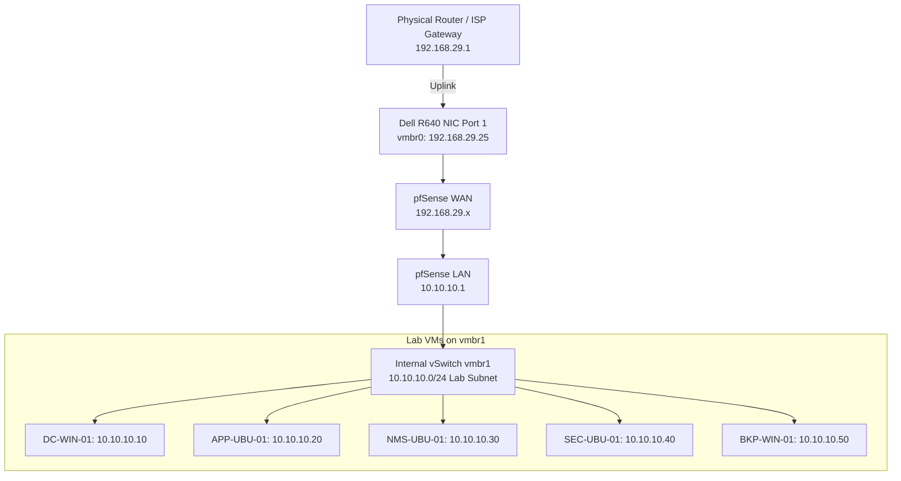

# Dell PowerEdge R640: Proxmox Virtualization Host Deployment

> **Document Purpose**: Comprehensive, end-to-end technical deployment record of the bare-metal Dell PowerEdge R640 physical hypervisor host powering the Think Polaris IT Internship Training Lab.

---

## 1. System Hardware & Host Specifications

| System Component | Specification / Configuration |
| :--- | :--- |
| **Server Hardware** | Dell PowerEdge R640 (1U Rackmount) |
| **Storage Drives** | 2x 960GB Samsung Enterprise SSDs (MZ7LH960) |
| **Storage Controller** | PERC H730 Mini (Embedded) — Configured in HBA Mode |
| **File System Architecture** | ZFS RAID-1 (Software Mirror `rpool` via Proxmox) |
| **Out-of-Band Management** | iDRAC9 Enterprise (Dedicated physical wrench-icon port) |
| **Power Supply Units** | Dual Redundant Hot-Swap PSUs (495W / 750W) |
| **Hypervisor OS** | Proxmox Virtual Environment (VE) 9.2-1 |
| **Host Management IP** | `192.168.29.25/24` (Static on NIC0 / Port 1) |
| **Default Gateway / DNS** | `192.168.29.1` / `192.168.29.1` |
| **Hostname & Localization** | `pve.lab.local` / India (`Asia/Kolkata`) |
| **Root Credentials** | User: `root` \| Password: `Guardian@2026_$` |

---

## 2. Phase-by-Phase Deployment Runbook

### Phase 1: Initial Hardware Connection & iDRAC Setup
1. **Physical Cabling**:
   - Connected an Ethernet cable to the dedicated **iDRAC management port** (marked with a wrench icon).
   - Connected a second Ethernet cable to **Port 1 (NIC0)** of the Network Daughter Card for hypervisor OS traffic and management.
2. **iDRAC Interface Access**:
   - Navigated to the assigned iDRAC IP address via a local web browser to access the remote management dashboard.
3. **Storage Visibility & Hardware Detection Troubleshooting**:
   - *Issue*: Installed Samsung SSDs were initially not detected by the storage backplane.
   - *Resolution*: Accessed **iDRAC Virtual Console > Power** and initiated a **Power Cycle System (Cold Boot)**. This forced a full flea-power drain and triggered the Dell Lifecycle Controller to rescan the backplane, successfully detecting all drives upon boot.

---

### Phase 2: RAID Controller Conversion (PERC H730 Mini HBA Passthrough)
1. **Wiping Legacy Disks**:
   - Navigated to **iDRAC > Storage > Virtual Disks** and deleted existing hardware RAID virtual disks to clear legacy Windows Server partition records.
2. **Controller Mode Switch (RAID to HBA Mode)**:
   - Navigated to **Storage > Controller Properties** and switched the **PERC H730 Mini** from *RAID Mode* to *HBA Mode* (Host Bus Adapter). This exposes the raw SSDs directly to Proxmox for native ZFS pool management.
3. **Applying Hardware Configuration**:
   - Scheduled the job as *At Next Reboot* and initiated a warm reset via the Virtual Console to apply the BIOS-level change.

---

### Phase 3: Proxmox VE Installation & ZFS Storage Mirroring
1. **Virtual Media Mapping**:
   - Downloaded the official Proxmox VE 9.2 ISO (1.71 GB).
   - In the iDRAC Virtual Console, attached the ISO via **Connect Virtual Media** and set *Next Boot* to **Virtual CD/DVD/ISO**.
2. **ZFS RAID-1 Configuration**:
   - Launched the graphical Proxmox installer.
   - On the *Target Harddisk* screen, clicked **Options**, changed filesystem from `ext4` to **`zfs (RAID1)`**, and selected `/dev/sda` and `/dev/sdb` to establish a fault-tolerant software mirrored root pool (`rpool`).
3. **Environment & Network Profile**:
   - **Location / Timezone**: India (`Asia/Kolkata`), Keymap: English.
   - **Administrator Email**: `abin@lab.local`.
   - **Hostname**: `pve.lab.local`.
   - **Management IP**: `192.168.29.25/24`.
   - **Gateway / DNS**: `192.168.29.1`.

---

### Phase 4: Post-Deployment Troubleshooting & Host Tuning

#### 1. Package Extraction Latency Resolution
- *Issue*: Installation crashed during extraction of `binutils-common.deb` due to network jitter over virtual media redirection.
- *Resolution*: Stabilized local network connection, rebooted via iDRAC Virtual Media, and re-executed the installation cleanly to 100% completion.

#### 2. Management Access Verification
- *Issue*: Initial browser connection timed out (`ERR_CONNECTION_TIMED_OUT`).
- *Resolution*: Enforced explicit **`https://`** protocol (`https://192.168.29.25:8006/`) and verified physical cable seating on Port 1.

#### 3. Enterprise Repository Replacement & System Upgrade
Executed in the Proxmox Node Shell to disable enterprise subscription nags and enable community package feeds:
```bash
# 1. Disable Enterprise Repositories
sed -i 's/^deb/#deb/' /etc/apt/sources.list.d/pve-enterprise.list
sed -i 's/^deb/#deb/' /etc/apt/sources.list.d/ceph.list 2>/dev/null || true

# 2. Add Proxmox No-Subscription Community Repository
cat <<EOF > /etc/apt/sources.list.d/pve-no-subscription.list
deb http://download.proxmox.com/debian/pve bookworm pve-no-subscription
EOF

# 3. Fully Update and Patch the Hypervisor Node
apt update && apt dist-upgrade -y
```

---

## 3. Virtual Networking Blueprint for Lab Infrastructure

With the bare-metal hypervisor active at `192.168.29.25`, virtual network bridges are structured as follows:

| Bridge | Interface / VLAN | Purpose | IP Configuration |
| :--- | :--- | :--- | :--- |
| **`vmbr0`** | Physical Port 1 (NIC0) | Management & WAN Uplink to Router (`192.168.29.0/24`) | `192.168.29.25/24` (Gateway `192.168.29.1`) |
| **`vmbr1`** | Internal Virtual Switch | Isolated Lab Subnet (`10.10.10.0/24`) | None on Host (Managed by pfSense VM `10.10.10.1`) |


