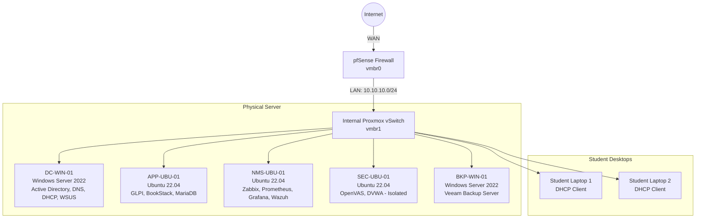

# IT Internship Training Program - Master Runbook

> **Note:** This is the complete offline manual, aligned with the Management Evaluation & Tooling PDFs.

---

## 1. Project Framework

*(See `Revised_Phase_Framework.md` for the complete architectural overview and 3-Phase breakdown).*

---

## 2. Lab Architecture & Design (P0)

> **Objective**: Document the initial design, IP allocation, and server roles before beginning the instructor build.

### 2.1 Architecture Topology

### 2.2 IP Allocation Plan

| Role / Hostname | IP Address | Subnet | Gateway | DNS |
| :--- | :--- | :--- | :--- | :--- |
| **pfSense LAN (GW)** | 10.10.10.1 | /24 | - | - |
| **DC-WIN-01 (AD/DNS)**| 10.10.10.10 | /24 | 10.10.10.1 | 127.0.0.1 |
| **APP-UBU-01** | 10.10.10.20 | /24 | 10.10.10.1 | 10.10.10.10 |
| **NMS-UBU-01** | 10.10.10.30 | /24 | 10.10.10.1 | 10.10.10.10 |
| **SEC-UBU-01** | 10.10.10.40 | /24 | 10.10.10.1 | 10.10.10.10 |
| **BKP-WIN-01** | 10.10.10.50 | /24 | 10.10.10.1 | 10.10.10.10 |
| **DHCP Scope** | 10.10.10.100 - .200| /24 | 10.10.10.1 | 10.10.10.10 |

### 2.3 Server Roles & Dependencies
*   **MariaDB Database**: Hosted on `APP-UBU-01`. Acts as the shared backend dependency for GLPI and BookStack.
*   **DNS Resolution**: All VMs and student laptops must point to `10.10.10.10` (DC-WIN-01) for DNS resolution to resolve domains like `glpi.apex.local`.

---

## 3. Admin Setup & Prerequisites

### P0 - P3: Instructor Admin Setup

> **Note**: This setup must be completed by the instructor before the students begin Phase 1.

## P0: Planning & Lab Design
- Map out the IP schema for the `10.10.10.0/24` subnet.
- Document VM naming conventions (e.g., `APP-SRV-01`, `DC-SRV-01`).
- Define lab safety rules.

## P1: Base Virtualization Platform
- **Tool**: Proxmox VE
- **Action**: Install Proxmox on a bare-metal physical server (minimum 12 cores, 96GB RAM, 2TB NVMe). Configure `vmbr0` (Management/WAN) and `vmbr1` (Internal LAN).

## P2: Core Lab Network
- **Tool**: pfSense
- **Action**: Deploy a pfSense VM. Connect WAN to `vmbr0` and LAN to `vmbr1`. Configure DHCP on `vmbr1` if required, but static IPs are preferred for servers. Create basic NAT rules.

## P3: Core Server Operating Systems
- **Tools**: Windows Server 2022, Ubuntu 22.04 LTS
- **Action**: 
    - Deploy `DC01` (Windows Server) on `vmbr1`.
    - Deploy `APP01` (Ubuntu Server) on `vmbr1`.
    - Deploy `NMS01` (Ubuntu Server) on `vmbr1`.

---

### Day Zero Orientation

> **Note**: This must be delivered to students *before* they touch any technical tools.

## 1. IT Environment Orientation
- **What is a Server?**: Explain the difference between client laptops and enterprise rack servers.
- **What is a Domain?**: Explain Active Directory, centralized authentication, and Group Policy.
- **Remote Access**: Teach students how to use Remote Desktop Connection (RDP) to access the Windows Server.

## 2. Basic Networking Concepts
- **IP Addressing**: Explain IPv4, Subnet Masks, and Default Gateways.
- **DNS & DHCP**: Explain how DNS resolves hostnames (`dc01.apex.local`) and how DHCP assigns IPs.
- **Domain Join**: Explain the process and requirements for a client machine to join an AD domain.

## 3. Simple ITIL/ITSM Basics
- **Incident vs. Request**: 
    - *Incident*: Something is broken (e.g., "I can't log in").
    - *Service Request*: Someone needs something new (e.g., "I need a new monitor").
- **Problem & Change**: Briefly explain root cause analysis (Problem) and controlled updates (Change).

---

## 4. Phase 1: Support Fundamentals

> **Objective**: Learn the core components of user identity, ticketing, and documentation.

## P4: Identity and Access Foundation
**Tools**: Active Directory, DNS, DHCP
**Scenario Lab**: 
1. Log into the `DC01` server via RDP.
2. Open Active Directory Users & Computers.
3. Create a test user account. Practice resetting the password and unlocking the account.
4. Verify the DHCP scope assigns IPs correctly to client laptops.

## P5: Access Utilities
**Tools**: PuTTY, WinSCP, RDP
**Scenario Lab**:
1. Download and install PuTTY and WinSCP on your student laptop.
2. Use PuTTY to SSH into the `APP01` Ubuntu server.
3. Use WinSCP to securely transfer a text file from your Windows laptop to the Ubuntu server.

## P6: Service Desk & Knowledge Base
**Tools**: GLPI, BookStack, MariaDB
**Scenario Lab**:
1. Access the GLPI web interface at `http://APP01/glpi`.
2. A user submits a ticket: "I cannot access my email." Claim the ticket.
3. **Soft Skills Integration**: Draft a professional, polite, and grammatically correct update to the end-user explaining the issue and the resolution steps. Paste this into the ticket before resolving it.
4. Access BookStack at `http://APP01/bookstack`. Write a Standard Operating Procedure (SOP) on how to reset an AD password.

## P7: Asset and Endpoint Inventory
**Tools**: OCS Inventory (integrated with GLPI)
**Scenario Lab**:
1. Install the OCS Inventory agent on a test Windows 10 VM.
2. Verify that the asset appears in the GLPI hardware inventory dashboard.
3. Link the hardware asset to a simulated IT ticket.

---

## 🏆 Phase 1 Assessment Checkpoint
Before progressing to Phase 2, students must pass this structured evaluation:
1. **Live Demonstration**: The student must share their screen and successfully reset an Active Directory user password while an instructor observes.
2. **Documentation Review**: The instructor reviews the student's BookStack SOP and a sample GLPI ticket response for technical accuracy and soft-skill professionalism.

---

## 5. Phase 2: Network Monitoring & Security

> **Objective**: Move from support into proactive operational thinking, packet analysis, and security visibility.

## Bridge Module: Network Basics
- Understand the OSI Model (Layers 2, 3, 4, 7).
- Practice basic commands: `ping`, `tracert`, `nslookup`.
- Understand firewall rules (Source, Destination, Port, Allow/Deny).

## P8: Basic Monitoring
**Tools**: Zabbix Server, Zabbix Agents
**Scenario Lab**:
1. Log into the Zabbix dashboard.
2. View the CPU and memory utilization of `DC01`.
3. Stop the DNS Server service on `DC01` to intentionally trigger a Zabbix alert. Acknowledge and resolve the alert.

## P9: Dashboards and Metrics
**Tools**: Prometheus, Grafana
**Scenario Lab**:
1. Explore the difference between Zabbix (classic agent monitoring) and Prometheus (time-series scraping).
2. Open Grafana and view a pre-built node-exporter dashboard showing live metrics from the Ubuntu servers.

## P10: Networking Lab Tools
**Tools**: Cisco Packet Tracer, Wireshark, Nmap
**Scenario Lab**:
1. Open Cisco Packet Tracer and build a simple topology with 2 PCs and 1 Switch to visualize ARP and MAC learning.
2. Run Wireshark on your laptop and capture ICMP packets while pinging a server.
3. Use Nmap to run a port scan against the `APP01` server to discover open services (e.g., ports 80, 22).

## P11: Security Monitoring
**Tools**: Wazuh (SIEM)
**Scenario Lab**:
1. Log into the Wazuh dashboard.
2. Attempt to SSH into `APP01` with the wrong password 5 times.
3. Locate the failed login alert in Wazuh and identify your laptop's source IP.

## P12: Vulnerability Lab
**Tools**: OpenVAS / Greenbone, DVWA, Kali Linux (Instructor Demo)
**Scenario Lab**:
1. Access the Damn Vulnerable Web App (DVWA) running in the isolated subnet.
2. Use OpenVAS to launch a vulnerability scan against the DVWA IP. Export the PDF report.
3. **Instructor Demo**: The instructor will perform a controlled demonstration using Kali Linux to scan the DVWA target, showing students how attackers map networks, for awareness purposes only.

---

## 🏆 Phase 2 Assessment Checkpoint
Before progressing to Phase 3, students must pass this structured evaluation:
1. **Live Demonstration**: The student must share their screen, successfully capture an ICMP packet in Wireshark, and identify the Source and Destination IP addresses.
2. **Log Identification**: The student must navigate the Wazuh dashboard and locate a specific simulated security alert (e.g., failed login) assigned by the instructor.

---

## 6. Phase 3: Advanced Administration & Automation

> **Objective**: Manage enterprise-scale workloads, implement disaster recovery, explore cloud computing, and automate routine tasks.

## P13: Backup and Recovery
**Tools**: Veeam Community Edition
**Scenario Lab**:
1. Log into the Veeam Backup Console on the Windows Server.
2. Create a backup job to back up the `APP01` server to a dedicated storage drive.
3. Run the backup manually. Once complete, perform a test file-level restore of a specific configuration file in `/etc/apache2`.

## P14: Patch Management
**Tools**: WSUS (Windows Server Update Services), Group Policy
**Scenario Lab**:
1. Log into the WSUS console on `DC01`.
2. Approve a critical Windows Defender definition update for deployment.
3. Create a GPO in Active Directory to configure client laptops to download updates from your internal WSUS server rather than Microsoft servers over the internet.

## P15: Remote Support and Endpoint Control
**Tools**: MeshCentral, RustDesk, Sysinternals Suite
**Scenario Lab**:
1. Launch MeshCentral and view the active endpoints.
2. An instructor will pretend to have a locked desktop. Use RustDesk to simulate a remote assistance session to unlock it for them.
3. Use Process Explorer (from the Sysinternals Suite) on a test VM to identify a hung application process and kill it safely.

## P16: Cloud and SaaS Exposure
**Tools**: Microsoft 365 Developer, Azure Free Account, ServiceNow Developer Instance
**Scenario Lab**:
1. Log into the M365 Admin Center. Understand how on-premise AD relates to Entra ID (Azure AD).
2. Create a cloud-only user account and assign them a license.
3. Log into your free ServiceNow Developer Instance. Create a mock Incident and see how it differs from your local GLPI system.

## P17: Automation and Version Control
**Tools**: VS Code, PowerShell 7, Python, Git, GitHub
**Scenario Lab**:
1. Install VS Code and Git on your laptop.
2. Write a PowerShell script that accepts a CSV file of 10 names and automatically creates Active Directory user accounts for them.
3. Commit your PowerShell script to a shared GitHub repository.
4. Write a simple Python script to ping a list of IPs and report which ones are offline.

## P18: Student Local Practice (Optional)
**Tools**: Oracle VirtualBox
**Scenario Lab**:
- If required for homework, install VirtualBox on your physical laptop and deploy a lightweight Ubuntu server to practice Linux commands locally without requiring VPN access to the main lab network.

---

## 🏆 Phase 3 Assessment Checkpoint
Before proceeding to the final Capstone, students must pass this structured evaluation:
1. **Live Demonstration**: The student must successfully restore a file from a Veeam backup.
2. **Script Execution**: The student must demonstrate their PowerShell or Python script working successfully against the live AD environment or network.

---

## 7. Capstone Project & Final Review

> **Objective**: Consolidate all knowledge from Phases 1-3 into a final, comprehensive presentation and architecture review.

## 1. Architecture Mapping (Draw.io)
Students must use Draw.io to map out the entire IT environment they have been supporting. 
*   **Requirements**: The diagram must include the pfSense firewall, the Active Directory server (DC01), the Ubuntu web servers, the Zabbix monitoring server, and the Veeam backup repository. It must accurately display the `10.10.10.0/24` IP addresses.

## 2. Troubleshooting Runbook Creation
Students must write a comprehensive Troubleshooting Runbook (in Markdown or BookStack) for a simulated "L1 to L3" crisis scenario.
*   **Scenario**: "A user cannot log in, the website is down, and we suspect a failed hard drive on the web server."
*   **Requirement**: The runbook must detail how to check Active Directory for lockouts (Phase 1), how to check Zabbix for server downtime (Phase 2), and how to initiate a Veeam restore for the web server (Phase 3).

## 3. Final Presentation
Students must present their Architecture Diagram and their Troubleshooting Runbook to the instructors. This tests their technical understanding and their professional soft skills.
