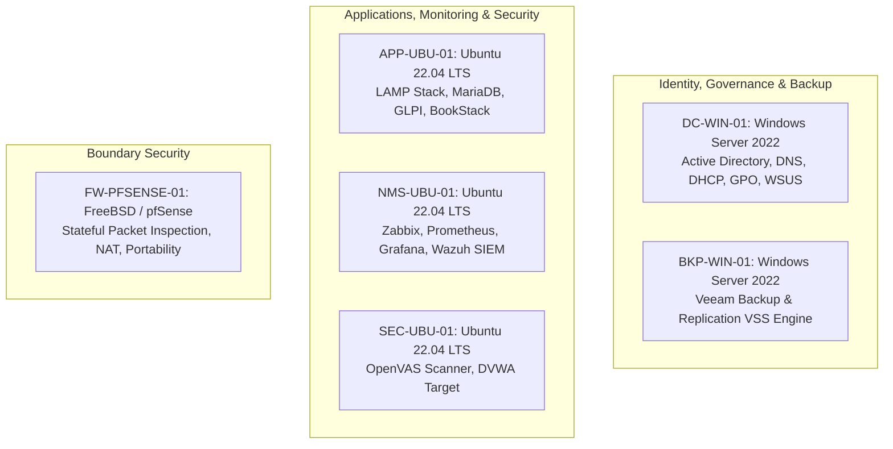

# Technology Selection & Architecture Rationale

> **Core Purpose**: Deep architectural justification for every operating system, software tool, driver, and VM tier deployed in the Think Polaris IT Internship Training Program.

---

## 1. Operating System Strategy: Why Windows vs. Why Linux?

In an enterprise IT infrastructure, neither Windows nor Linux exists in isolation. Modern IT environments are **hybrid ecosystems** where Windows dominates identity/governance and Linux powers backend services/monitoring.



---

### A. Why Windows Server 2022?
1. **Enterprise Identity Standard (Active Directory Domain Services)**:
   - Active Directory manages centralized authentication across enterprise objects (users, computers, service accounts).
   - Interns must learn real-world Active Directory administration: Organization Units (OUs), Group Policy Objects (GPOs), Kerberos ticket granting, and password lifecycle policies.
2. **Authoritative Name Resolution & Dynamic DHCP**:
   - `DC-WIN-01` serves as the authoritative internal DNS server for `*.thinkpolaris.local`, allowing dynamic DNS registration when student laptops and Linux servers join the network.
3. **Enterprise Patch Management (WSUS)**:
   - Microsoft WSUS provides centralized approval and scheduling of Windows security updates via GPO.
4. **Veeam Backup & Replication Compatibility**:
   - Veeam's core management server requires Windows Server for native Volume Shadow Copy Service (VSS) coordination, repository mounting, and synthetic full backup processing.

---

### B. Why Ubuntu Server 22.04 LTS?
1. **Production Open-Source Ecosystem**:
   - The world's top IT service management (GLPI), knowledge management (BookStack), infrastructure monitoring (Zabbix/Prometheus), visualization (Grafana), and SIEM (Wazuh) systems are native to Linux.
2. **Resource Efficiency & Scalability**:
   - Headless Ubuntu Server consumes minimal RAM (~500MB idle), enabling all 6 VMs to run concurrently on the physical Dell PowerEdge R640 without resource contention.
3. **Intern Competency Development**:
   - Students learn crucial enterprise Linux administration skills: `systemd` service management, file permissions (`chmod`/`chown`), MariaDB SQL administration, SSH key management, cron automation, and package lifecycle (`apt`).

---

### C. Why FreeBSD / pfSense?
1. **Rock-Solid Network Routing & Firewall**:
   - FreeBSD's `pf` (Packet Filter) provides high-performance stateful inspection, transparent NAT, and network isolation.
2. **Zero-Friction Physical Server Portability**:
   - Encapsulates the entire lab behind dynamic WAN DHCP on `vmbr0` while maintaining a static internal ecosystem on `vmbr1` (`10.10.10.0/24`).

---

## 2. Virtual Machine Categorization & Role Matrix

| VM ID | Hostname | OS Platform | vCPU | RAM | Disk | Primary Services & Tooling | Architectural Justification |
| :--- | :--- | :--- | :--- | :--- | :--- | :--- | :--- |
| **100** | `FW-PFSENSE-01` | FreeBSD / pfSense 2.7.2 | 2 | 2 GB | 20 GB | pfSense Firewall, NAT, DHCP, SPI Gateway | Single boundary between external network (`vmbr0`) and isolated lab LAN (`vmbr1`). |
| **101** | `DC-WIN-01` | Windows Server 2022 | 2 | 4 GB | 60 GB | Active Directory (AD DS), DNS (`10.10.10.10`), DHCP, WSUS | Central identity provider and name resolution authority for `thinkpolaris.local`. |
| **102** | `APP-UBU-01` | Ubuntu 22.04 LTS | 2 | 4 GB | 40 GB | MariaDB 10.6, GLPI 10.0, BookStack, PHP 8.1, Apache2 | Central IT service desk ticketing and standard operating procedure (SOP) documentation. |
| **103** | `NMS-UBU-01` | Ubuntu 22.04 LTS | 4 | 8 GB | 60 GB | Zabbix Server 6.4, Prometheus, Grafana, Wazuh SIEM Manager | Unified Network Management Station, telemetry metrics collection, and security monitoring. |
| **104** | `SEC-UBU-01` | Ubuntu 22.04 LTS | 2 | 4 GB | 40 GB | Greenbone / OpenVAS Vulnerability Scanner, Docker, DVWA | Isolated security practice target for safe vulnerability assessment and remediation labs. |
| **105** | `BKP-WIN-01` | Windows Server 2022 | 2 | 4 GB | 80 GB | Veeam Backup & Replication 12 CE, Hardened Backup Repository | Disaster recovery orchestration, automated VM snapshotting, and bare-metal restoration testing. |

---

## 3. Storage & Paravirtualization Drivers (`virtio-win.iso`)

| Component | Technical Role | Why It Is Mandatory |
| :--- | :--- | :--- |
| **`vioscsi`** | VirtIO SCSI Storage Driver | Windows Server installer cannot detect Proxmox `VirtIO SCSI single` ZFS virtual disks without this driver loaded during installation. |
| **`NetKVM`** | VirtIO Network Driver | Provides 10Gbps+ paravirtualized network throughput on `vmbr1` with minimal CPU overhead compared to legacy emulated `e1000` adapters. |
| **`qemu-ga`** | QEMU Guest Agent Service | Enables Proxmox host to execute filesystem-consistent snapshots, live memory ballooning, and clean OS shutdowns. |

---

## 4. Architectural Analysis: Virtual pfSense (Current) vs. Dedicated Physical Hardware

### Question: Is it better to deploy pfSense on a separate physical machine to isolate failures?

```mermaid
graph TD
    subgraph Option A: Virtual pfSense (Current All-in-One Box)
        Host[Dell PowerEdge R640 Hypervisor] -->|Internal Memory Bus vmbr1| VMs[DC01, APP01, NMS01, SEC01, BKP01]
        Host -->|VM 100| V_PFSENSE[pfSense VM]
        V_PFSENSE -->|10Gbps+ Virtual Bridge| VMs
    end

    subgraph Option B: Dedicated Physical Appliance
        Router[Physical Mini-PC / Netgate Appliance] -->|Physical Cable| Switch[Physical Managed Switch]
        Switch -->|Physical Cable Port 1| Host2[Dell PowerEdge R640]
        Switch -->|Physical Ethernet / AP| Clients[Student Laptops]
    end
```

### Detailed Trade-Off Comparison

| Evaluation Metric | Virtual pfSense on Proxmox (Current) | Dedicated Physical pfSense Appliance |
| :--- | :--- | :--- |
| **Portability & Turnkey Replication** | ⭐⭐⭐⭐⭐ **Superior**: The entire training ecosystem is encapsulated in **1 single 1U Dell server**. Move to any institute by carrying 1 server, plugging 1 power cable, and 1 uplink. | ⭐⭐ **Complex**: Requires packing, transporting, and re-cabling separate mini-PCs, external power adapters, and patch cables. |
| **Inter-VM Throughput** | ⭐⭐⭐⭐⭐ **Wire-Speed (10-20 Gbps)**: Routing between internal lab VMs happens in-memory across the Linux virtual bridge (`vmbr1`) without physical NIC bottlenecks. | ⭐⭐⭐ **Limited to 1 Gbps / 2.5 Gbps**: All inter-subnet traffic must traverse physical Ethernet cables and switch ports. |
| **Disaster Recovery & Snapshots** | ⭐⭐⭐⭐⭐ **Instant (5 Seconds)**: Proxmox ZFS snapshots allow 1-click rollback before teaching dangerous firewall rules, Snort/Suricata, or routing labs. | ⭐⭐ **Slow**: Requires manual USB reflashing, console cable recovery, or XML config restore. |
| **Hardware Cost & Complexity** | ⭐⭐⭐⭐⭐ **Zero Additional Cost**: Runs within existing Dell R640 compute resources (2 vCPUs, 2 GB RAM). | ⭐⭐ **Additional Capex**: Requires purchasing dedicated multi-NIC appliances (e.g., Protectli, Netgate) + managed switch. |
| **Hypervisor Failure Isolation** | ⭐⭐⭐ **Coupled**: If Proxmox host reboots, pfSense reboots with it (starts first via `order=1`). | ⭐⭐⭐⭐⭐ **Decoupled**: Local internet / Wi-Fi routing remains active even if the Proxmox server is powered off. |

### Final Architecture Recommendation:
- **For this Training Institute Lab**: **Virtual pfSense on Proxmox is the optimal and recommended design**. It guarantees 100% turnkey replication for other institutes, instant snapshot recovery during student training, zero hardware bloat, and wire-speed routing across `vmbr1`.

---

### Pedagogical & Enterprise Realism: Why Virtual pfSense Matches Corporate Standards

1. **100% Feature & Experience Parity**:
   - The pfSense webConfigurator, state table, alias management, NAT port forwarding, DNS Resolver (Unbound), DHCP scopes, and firewall rules are **bit-for-bit identical** whether virtualized on Proxmox or running on a \$5,000 physical Netgate appliance.
   - Interns learn authentic enterprise firewall workflows: inspecting logs, troubleshooting dropped packets, defining egress filtering, and restricting inter-VLAN/subnet traffic.

2. **The "Safety Net" Advantage in Education**:
   - In production, misconfiguring a firewall causes an immediate network outage.
   - In Proxmox, the instructor takes a **ZFS Snapshot** before every student networking lab. If an intern accidentally creates a rule that locks out the management interface, the instructor restores the firewall in 5 seconds without rebooting physical hardware or attaching serial console cables.


---

## 5. Technical Breakdown & Command Rationale: `APP-UBU-01` Core Stack

### A. Command 1 Rationale: Web, Database & PHP Runtime Dependencies
```bash
sudo apt update && sudo apt install -y apache2 mariadb-server curl wget unzip git \
  php8.1 php8.1-curl php8.1-gd php8.1-intl php8.1-mbstring \
  php8.1-mysql php8.1-xml php8.1-zip php8.1-bz2 php8.1-ldap \
  php8.1-cli php8.1-soap php8.1-bcmath libapache2-mod-php8.1
```
- **Why Apache2 (`apache2`, `libapache2-mod-php8.1`)**: Industry-standard HTTP web server capable of running multiple virtual hosts (GLPI on port 80, BookStack on port 8080) with `.htaccess` rewriting rules (`a2enmod rewrite`).
- **Why MariaDB Server (`mariadb-server`)**: Relational database engine supporting ACID transactions, foreign keys, and full `utf8mb4` Unicode character sets required by GLPI and BookStack.
- **Why Each PHP 8.1 Extension is Mandatory**:
  - `php8.1-mysql`: Driver enabling PHP to connect to MariaDB.
  - `php8.1-ldap`: Enables GLPI and BookStack to authenticate users directly against Active Directory (`thinkpolaris.local` / `DC-WIN-01`).
  - `php8.1-intl` & `php8.1-mbstring`: Internationalization and multibyte string handling for multilingual tickets and SOP articles.
  - `php8.1-gd`: Graphics library for rendering PDF attachments, tickets, and user avatars.
  - `php8.1-curl` & `php8.1-xml`: REST API communication and XML parsing for GLPI agent inventory ingestion.
  - `php8.1-zip` & `php8.1-bz2`: Compressed archive extraction for plugins, marketplace add-ons, and backup exports.
  - `php8.1-bcmath` & `php8.1-soap`: Precision calculations and legacy SOAP integration for enterprise plugins.

---

### B. Command 2 Rationale: Database Provisioning & Security Isolation
```bash
CREATE DATABASE glpidb CHARACTER SET utf8mb4 COLLATE utf8mb4_unicode_ci;
CREATE USER 'glpiuser'@'localhost' IDENTIFIED BY 'Guardian@2026_$';
GRANT ALL PRIVILEGES ON glpidb.* TO 'glpiuser'@'localhost';

CREATE DATABASE bookstackdb CHARACTER SET utf8mb4 COLLATE utf8mb4_unicode_ci;
CREATE USER 'bookstackuser'@'localhost' IDENTIFIED BY 'Guardian@2026_$';
GRANT ALL PRIVILEGES ON bookstackdb.* TO 'bookstackuser'@'localhost';
```
- **Why UTF8MB4 Collation**: Standard `utf8` in MySQL only supports 3-byte characters. `utf8mb4_unicode_ci` supports full 4-byte characters (emojis, mathematical symbols, modern Unicode).
- **Why Dedicated Least-Privilege Users**: `glpiuser` and `bookstackuser` are isolated to `localhost` and restricted strictly to their own databases, preventing cross-application database exposure.

---

### C. Command 3 Rationale: Application Deployment & File Permissions
```bash
wget https://github.com/glpi-project/glpi/releases/download/10.0.16/glpi-10.0.16.tgz
tar -xzf glpi-10.0.16.tgz -C /var/www/html/
chown -R www-data:www-data /var/www/html/glpi
chmod -R 755 /var/www/html/glpi
```
- **Why `/var/www/html/glpi`**: Standard Apache document root directory on Debian/Ubuntu.
- **Why `www-data:www-data` & `755` Permissions**: Apache's runtime user (`www-data`) must have read/write access to GLPI cache, logs, marketplace, and upload directories (`/var/www/html/glpi/files/`), while disallowing unauthorized external modification (`755` directory permissions).
