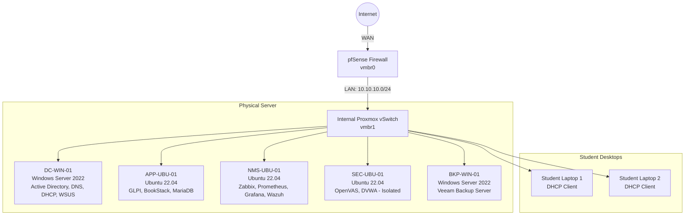

# Lab Architecture & Design (P0)

> **Objective**: Document the initial design, IP allocation, and server roles before beginning the instructor build.

## 1. Architecture Topology

## 2. IP Allocation Plan

| Role / Hostname | IP Address | Subnet | Gateway | DNS |
| :--- | :--- | :--- | :--- | :--- |
| **pfSense LAN (GW)** | 10.10.10.1 | /24 | - | - |
| **DC-WIN-01 (AD/DNS)**| 10.10.10.10 | /24 | 10.10.10.1 | 127.0.0.1 |
| **APP-UBU-01** | 10.10.10.20 | /24 | 10.10.10.1 | 10.10.10.10 |
| **NMS-UBU-01** | 10.10.10.30 | /24 | 10.10.10.1 | 10.10.10.10 |
| **SEC-UBU-01** | 10.10.10.40 | /24 | 10.10.10.1 | 10.10.10.10 |
| **BKP-WIN-01** | 10.10.10.50 | /24 | 10.10.10.1 | 10.10.10.10 |
| **DHCP Scope** | 10.10.10.100 - .200| /24 | 10.10.10.1 | 10.10.10.10 |

## 3. Server Roles & Dependencies
*   **MariaDB Database**: Hosted on `APP-UBU-01`. Acts as the shared backend dependency for GLPI and BookStack.
*   **DNS Resolution**: All VMs and student laptops must point to `10.10.10.10` (DC-WIN-01) for DNS resolution to resolve domains like `glpi.apex.local`.
