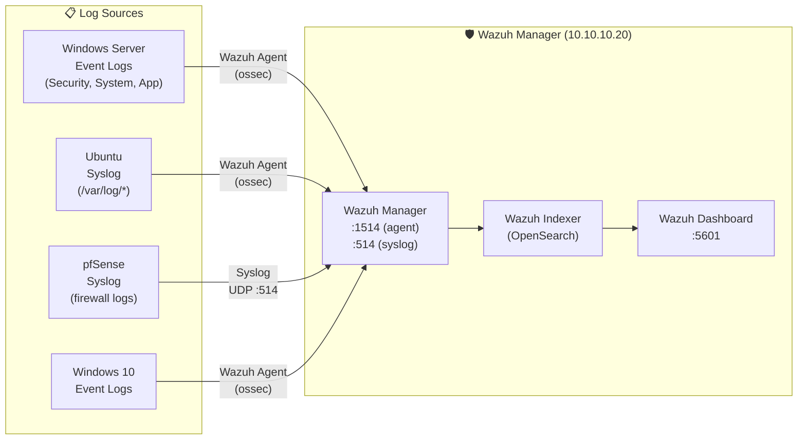
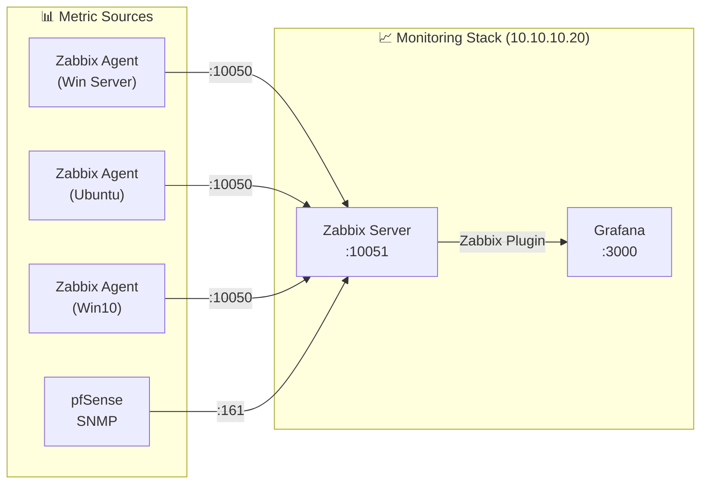
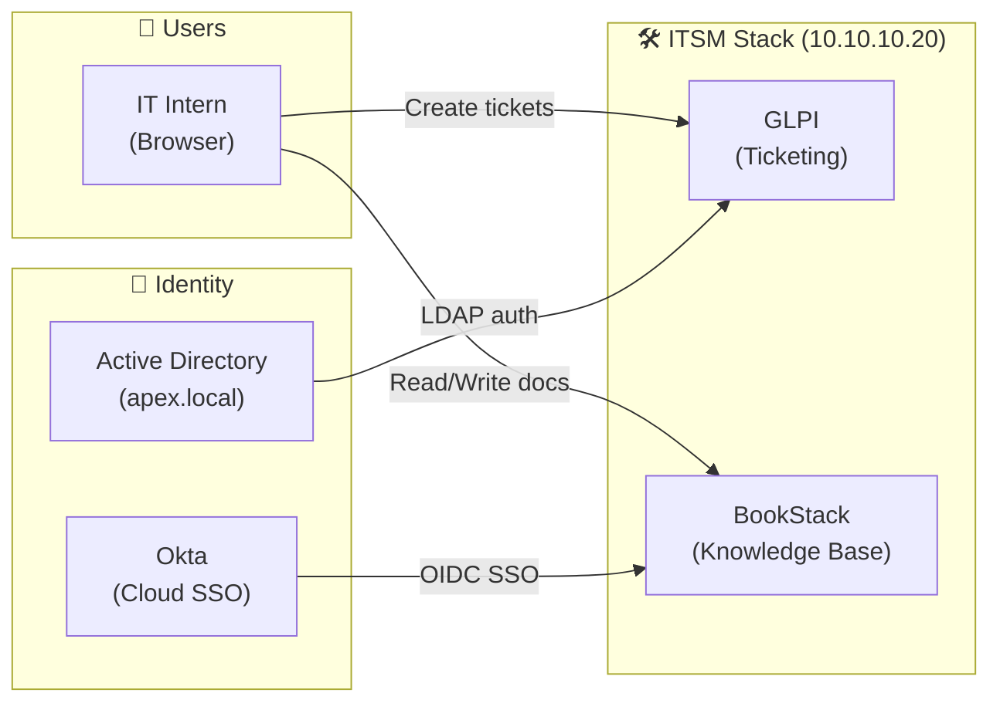
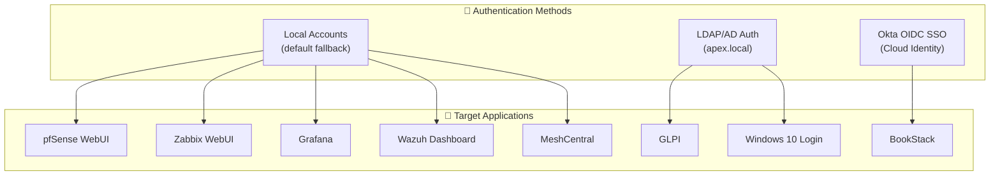
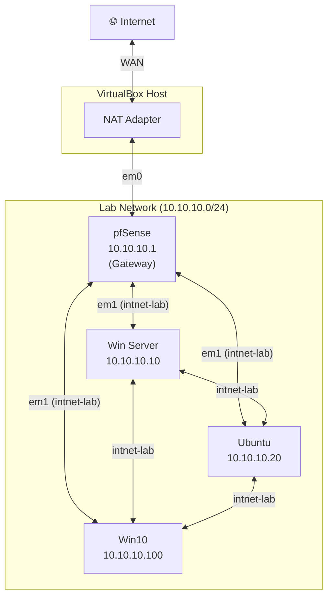

# 🏗️ Think Polaris IT Internship Training Program — Ecosystem Architecture Map

> **Purpose**: Maps how every tool in the Minimum Viable Lab interconnects as a unified ecosystem.
> **Audience**: Someone building this lab on a laptop (VirtualBox, 12 GB RAM, D: drive for VMs).
> **Network**: `10.10.10.0/24` — all VMs on a single internal network behind pfSense.

---

## Table of Contents

- [1. Ecosystem Dependency Map](#1-ecosystem-dependency-map)
- [2. Data Flow Diagram](#2-data-flow-diagram)
- [3. Authentication Flow](#3-authentication-flow)
- [4. Network Traffic Flow](#4-network-traffic-flow)
- [5. Database Dependencies](#5-database-dependencies)
- [6. Port Reference Table](#6-port-reference-table)
- [7. VM Resource Allocation Table](#7-vm-resource-allocation-table)
- [8. Tool-to-Tool Integration Matrix](#8-tool-to-tool-integration-matrix)

---

## 1. Ecosystem Dependency Map

This section shows the hierarchical dependency tree — what depends on what, from the hypervisor up.

### 1.1 Layered Architecture Overview

```mermaid
graph TB
    subgraph HOST["🖥️ Host Laptop (Windows 11)"]
        VB["VirtualBox 7.x"]
        VSCODE["VS Code"]
        PS["PowerShell 7"]
        PY["Python 3.x"]
        GIT["Git + GitHub"]
        DRAW["Draw.io"]
        PUTTY["PuTTY"]
        WINSCP["WinSCP"]
        SYSINTERNALS["Sysinternals Suite"]
        WIRESHARK["Wireshark"]
        CPT["Cisco Packet Tracer"]
    end

    subgraph CLOUD["☁️ Cloud Layer (Browser-Based)"]
        M365["Microsoft 365 Dev Tenant"]
        AZURE["Azure Free Account"]
        SNOW["ServiceNow Dev Instance"]
        OKTA["Okta Developer Tenant"]
        CF["Cloudflare (DNS + Tunnels)"]
    end

    subgraph VMS["🖧 VirtualBox VM Layer"]
        subgraph PFSENSE["🔥 pfSense VM (10.10.10.1)"]
            FW["Firewall / NAT"]
            DHCPPF["DHCP (optional)"]
            SNMPPF["SNMP Agent"]
        end

        subgraph WINSVR["🪟 Windows Server 2022 (10.10.10.10)"]
            AD["AD DS (apex.local)"]
            DNS["DNS Server"]
            DHCP["DHCP Server"]
            GPO["Group Policy"]
            WSUS["WSUS"]
            VEEAM["Veeam CE"]
            WAZUH_A1["Wazuh Agent"]
            ZABBIX_A1["Zabbix Agent"]
            OCS_A1["OCS Agent"]
        end

        subgraph UBUNTU["🐧 Ubuntu Server 22.04 (10.10.10.20)"]
            MARIADB["MariaDB"]
            GLPI["GLPI (ITSM)"]
            BOOKSTACK["BookStack (KB)"]
            ZABBIX_S["Zabbix Server"]
            GRAFANA["Grafana"]
            PROMETHEUS["Prometheus (future)"]
            WAZUH_S["Wazuh Manager"]
            OPENVAS["OpenVAS/Greenbone"]
            DVWA["DVWA"]
            MESHCENTRAL["MeshCentral"]
            OCS_S["OCS Inventory Server"]
            WAZUH_A2["Wazuh Agent (local)"]
            ZABBIX_A2["Zabbix Agent (local)"]
            OCS_A2["OCS Agent (local)"]
            CLOUDFLARED["Cloudflared Tunnel"]
        end

        subgraph WIN10["💻 Windows 10 Client (10.10.10.100)"]
            DOMAIN_JOIN["Domain-Joined (apex.local)"]
            NMAP["Nmap"]
            RUSTDESK["RustDesk"]
            MESH_A["MeshCentral Agent"]
            WAZUH_A3["Wazuh Agent"]
            ZABBIX_A3["Zabbix Agent"]
            OCS_A3["OCS Agent"]
        end
    end

    VB --> PFSENSE
    VB --> WINSVR
    VB --> UBUNTU
    VB --> WIN10

    PFSENSE -->|"gateway for all"| WINSVR
    PFSENSE -->|"gateway for all"| UBUNTU
    PFSENSE -->|"gateway for all"| WIN10

    AD -->|"LDAP auth"| GLPI
    AD -->|"domain login"| WIN10
    AD -->|"DNS resolution"| DNS

    MARIADB -->|"backend DB"| GLPI
    MARIADB -->|"backend DB"| BOOKSTACK
    MARIADB -->|"backend DB"| ZABBIX_S

    ZABBIX_S -->|"data source"| GRAFANA
    PROMETHEUS -->|"data source (future)"| GRAFANA

    ZABBIX_A1 -->|"metrics"| ZABBIX_S
    ZABBIX_A2 -->|"metrics"| ZABBIX_S
    ZABBIX_A3 -->|"metrics"| ZABBIX_S
    SNMPPF -->|"SNMP polling"| ZABBIX_S

    WAZUH_A1 -->|"logs/events"| WAZUH_S
    WAZUH_A2 -->|"logs/events"| WAZUH_S
    WAZUH_A3 -->|"logs/events"| WAZUH_S

    OCS_A1 -->|"inventory"| OCS_S
    OCS_A2 -->|"inventory"| OCS_S
    OCS_A3 -->|"inventory"| OCS_S

    OPENVAS -->|"scans"| WINSVR
    OPENVAS -->|"scans"| PFSENSE
    OPENVAS -->|"scans"| WIN10
    OPENVAS -->|"scans"| DVWA

    MESHCENTRAL -->|"remote mgmt"| MESH_A

    OKTA -->|"SAML/OIDC SSO"| BOOKSTACK
    CLOUDFLARED -->|"secure tunnel"| CF

    PUTTY -->|"SSH"| UBUNTU
    PUTTY -->|"SSH"| PFSENSE
    WINSCP -->|"SCP/SFTP"| UBUNTU
    WIRESHARK -->|"captures traffic"| WIN10
```



### 1.2 Text-Based Dependency Tree

```
VirtualBox (D:\LabVMs\)
├── pfSense (10.10.10.1) ──────────────────────────── Gateway for ALL VMs
│   ├── NAT ← provides internet to all VMs
│   ├── Firewall Rules ← controls inter-VM and outbound traffic
│   ├── DHCP (optional) ← can assign IPs if needed
│   └── SNMP Agent ──→ Zabbix Server (polling)
│
├── Windows Server 2022 (10.10.10.10) ─────────────── Identity & Policy Hub
│   ├── AD DS (apex.local)
│   │   ├── ──→ Win10 Client (domain join, GPO, login)
│   │   ├── ──→ GLPI (LDAP authentication)
│   │   └── ──→ BookStack (LDAP authentication, optional)
│   ├── DNS Server
│   │   └── ──→ All VMs (name resolution, A records)
│   ├── DHCP Server
│   │   └── ──→ Win10 Client (IP assignment, optional)
│   ├── GPO
│   │   └── ──→ Win10 Client (policy enforcement)
│   ├── WSUS
│   │   └── ──→ Win10 Client + Self (patch management)
│   ├── Veeam CE
│   │   └── ──→ VirtualBox API (VM-level backup)
│   ├── Zabbix Agent ──→ Zabbix Server (10.10.10.20)
│   ├── Wazuh Agent ──→ Wazuh Manager (10.10.10.20)
│   └── OCS Agent ──→ OCS Server (10.10.10.20)
│
├── Ubuntu Server 22.04 (10.10.10.20) ─────────────── Service Hub
│   ├── MariaDB (shared backend)
│   │   ├── DB: glpidb ──→ GLPI
│   │   ├── DB: bookstackdb ──→ BookStack
│   │   └── DB: zabbixdb ──→ Zabbix Server
│   ├── GLPI (/glpi)
│   │   ├── ← LDAP from AD (user sync)
│   │   ├── ← OCS Inventory (asset import, optional)
│   │   └── ← Users (ticket creation via browser)
│   ├── BookStack (/bookstack)
│   │   ├── ← Users (KB access via browser)
│   │   └── ← Okta SSO (OIDC authentication)
│   ├── Zabbix Server
│   │   ├── ← Zabbix Agents (Win Server, Ubuntu, Win10)
│   │   ├── ← SNMP (pfSense)
│   │   ├── ──→ Grafana (as data source)
│   │   └── ──→ Alerts (email/webhook)
│   ├── Grafana (:3000)
│   │   ├── ← Zabbix (data source plugin)
│   │   └── ← Prometheus (data source, future)
│   ├── Prometheus (future, :9090)
│   │   └── ← Node Exporters on all VMs
│   ├── Wazuh Manager (:1514, :1515, :55000)
│   │   ├── ← Wazuh Agents (Win Server, Ubuntu, Win10)
│   │   ├── ← pfSense syslog
│   │   └── ──→ Dashboard (:5601, Kibana/Wazuh UI)
│   ├── OpenVAS/Greenbone (:9392)
│   │   └── ──→ Scans all hosts in 10.10.10.0/24
│   ├── DVWA (:8080)
│   │   └── ← OpenVAS + Nmap (scan target)
│   ├── MeshCentral (:443)
│   │   └── ──→ MeshCentral Agent on Win10
│   ├── OCS Inventory Server (:80xx)
│   │   └── ← OCS Agents (all machines)
│   ├── Cloudflared Tunnel
│   │   └── ──→ Cloudflare (exposes Apache to custom domain)
│   ├── Zabbix Agent (local) ──→ Zabbix Server (self)
│   ├── Wazuh Agent (local) ──→ Wazuh Manager (self)
│   └── OCS Agent (local) ──→ OCS Server (self)
│
└── Windows 10 Client (10.10.10.100) ──────────────── End-User Workstation
    ├── Domain-joined to apex.local
    │   ├── ← GPO enforcement from Win Server
    │   ├── ← WSUS patches from Win Server
    │   └── ← DNS from Win Server (10.10.10.10)
    ├── Nmap ──→ scans all hosts
    ├── Wireshark ──→ captures local NIC traffic
    ├── RustDesk ──→ remote desktop (peer-to-peer)
    ├── MeshCentral Agent ──→ MeshCentral Server (Ubuntu)
    ├── Zabbix Agent ──→ Zabbix Server (Ubuntu)
    ├── Wazuh Agent ──→ Wazuh Manager (Ubuntu)
    └── OCS Agent ──→ OCS Server (Ubuntu)
```

---

## 2. Data Flow Diagram

### 2.1 Log Flow



### 2.2 Metrics Flow



### 2.3 Ticket & Knowledge Flow



---

## 3. Authentication Flow



---

## 4. Network Traffic Flow



---

## 5. Database Dependencies

All databases run on **MariaDB (10.10.10.20)**:

| Database Name | Used By | Purpose |
|---|---|---|
| `glpidb` | GLPI | Tickets, assets, users, configurations |
| `bookstackdb` | BookStack | Pages, shelves, books, user data |
| `zabbixdb` | Zabbix Server | Hosts, items, triggers, history, trends |

MariaDB listens on `10.10.10.20:3306` (localhost only by default).

---

## 6. Port Reference Table

| Port | Protocol | Service | VM | Direction |
|---|---|---|---|---|
| 22 | TCP | SSH | Ubuntu, pfSense | Inbound |
| 80 | TCP | HTTP (Apache) | Ubuntu | Inbound |
| 443 | TCP | HTTPS (MeshCentral) | Ubuntu | Inbound |
| 443 | TCP | HTTPS (pfSense WebUI) | pfSense | Inbound |
| 161 | UDP | SNMP | pfSense | Inbound (from Zabbix) |
| 514 | UDP | Syslog | Ubuntu (Wazuh) | Inbound (from pfSense) |
| 1514 | TCP | Wazuh Agent | Ubuntu (Wazuh) | Inbound |
| 1515 | TCP | Wazuh Registration | Ubuntu (Wazuh) | Inbound |
| 3000 | TCP | Grafana | Ubuntu | Inbound |
| 3306 | TCP | MariaDB | Ubuntu | Localhost only |
| 5601 | TCP | Wazuh Dashboard | Ubuntu | Inbound |
| 8080 | TCP | DVWA | Ubuntu | Inbound |
| 9392 | TCP | OpenVAS/Greenbone | Ubuntu | Inbound |
| 10050 | TCP | Zabbix Agent | All VMs | Inbound (from Zabbix Server) |
| 10051 | TCP | Zabbix Server | Ubuntu | Inbound (from Agents) |
| 55000 | TCP | Wazuh API | Ubuntu | Inbound |

---

## 7. VM Resource Allocation Table

| VM | vCPUs | RAM | Disk | Network | OS |
|---|---|---|---|---|---|
| pfSense | 1 | 512 MB | 8 GB | NAT + intnet-lab | FreeBSD (pfSense) |
| Windows Server 2022 | 2 | 3 GB | 40 GB | intnet-lab | Windows Server 2022 |
| Ubuntu Server 22.04 | 2 | 2 GB | 30 GB | intnet-lab | Ubuntu 22.04 LTS |
| Windows 10 Client | 2 | 2 GB | 30 GB | intnet-lab | Windows 10 Enterprise |
| **TOTAL** | **7** | **7.5 GB** | **108 GB** | — | — |

> ⚠️ Host needs at least 12 GB RAM total (7.5 GB for VMs + 4.5 GB for Windows 11 host).

---

## 8. Tool-to-Tool Integration Matrix

| Source Tool | Target Tool | Integration Type | Protocol | Purpose |
|---|---|---|---|---|
| AD DS | GLPI | LDAP Auth | LDAP :389 | User authentication |
| AD DS | Win10 Client | Domain Join | Kerberos | Login, GPO, DNS |
| Okta | BookStack | SSO | OIDC (HTTPS) | Single Sign-On |
| Zabbix Agent (all) | Zabbix Server | Metrics | TCP :10050/10051 | Performance monitoring |
| pfSense SNMP | Zabbix Server | SNMP Poll | UDP :161 | Network monitoring |
| Zabbix Server | Grafana | Data Source | HTTP API | Dashboard visualization |
| Wazuh Agent (all) | Wazuh Manager | Log Shipping | TCP :1514 | SIEM log collection |
| pfSense Syslog | Wazuh Manager | Syslog | UDP :514 | Firewall log collection |
| OpenVAS | All Hosts | Vuln Scan | Various | Security scanning |
| OCS Agent (all) | OCS Server | Inventory | HTTP | Asset management |
| MeshCentral | Win10 Agent | Remote Desktop | HTTPS :443 | Remote management |
| Veeam CE | VirtualBox API | Backup | Local API | VM backup/restore |
| Cloudflared | Cloudflare | Tunnel | HTTPS | Expose local services to custom domain |
| WSUS | Win Server + Win10 | Updates | HTTP | Patch management |
